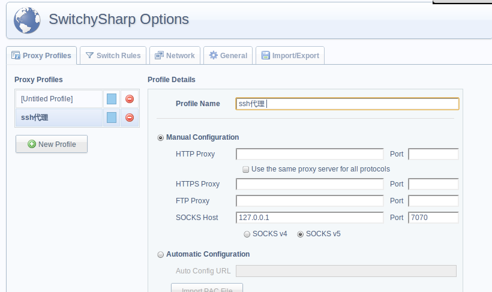

=================
ssh 代理使用
=================

.. _ssh-proxy:

:作者: 张卫 `zhwei.sinaapp.com <http://zhwei.sinaapp.com/>`_

linux系统下的ssh代理使用方法
----------------------------------

将SSH服务映射到本地端口来实现Socks代理服务器的功能

执行::

    ssh -qTfnN -D 7070 xxx@x.x.x.x -p port

-D 加本地端口
xxx@x.x.x.x -p port 为ssh代理服务器

chrome可用Auto Switch Mode进行配置代理规则

windows系统ssh代理使用方法
------------------------------------

  SSH转Socks代理服务器工具：MyEnTunnel

  `点此下载 MyEnTunnel <http://truevue.org/sites/default/files/files/2010/02/myentunnel-%E4%B8%AD%E6%96%87%E7%89%88.zip>`_

使用MyEnTunnel将SSH服务映射到本地端口来实现Socks代理服务器的功能，默认socks代理的端口是7070，默认情况下是不启用代理的，需要选中“Enable Dynamic Socks”选项。

.. image:: _image/myentunnel.gif
