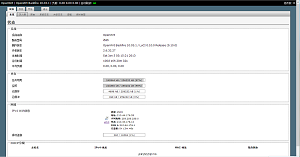
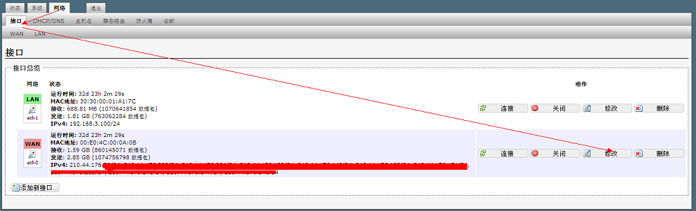
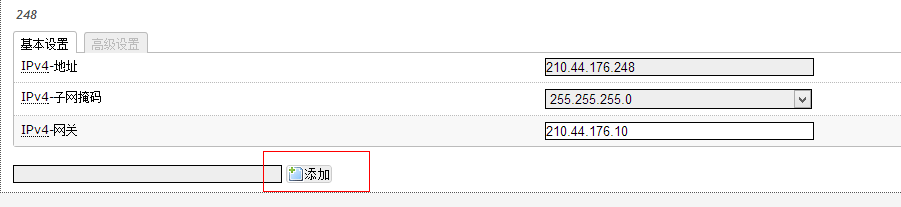
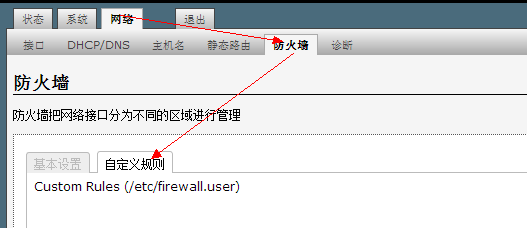
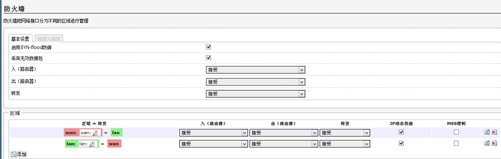

====================
OpenWrt 软路由
====================
OpenWrt是适合于嵌入式设备的一个Linux发行版。
相对原厂固件而言，OpenWrt不是一个单一、静态的固件，而是提供了一个可添加软件包的可写的文件系统。这使使用者可以自由的选择应用程序和配置，而不必受设备提供商的限制，并且可以使用一些适合某方面应用的软件包来定制你的设备。对于开发者来说，OpenWrt是一个框架，開發者不必麻烦的构建整个固件就能得到想要的应用程序；对于使用者来说，这意味着完全定制的能力，與以往不同的方式使用设备。

`wirelesser 提供最优的无线产品解决方案 <http://www.wirelesser.com/>`_

准备工作
-------------------

#. 旧电脑
#. linux live cd 启动盘
#. openwrt x86 镜像

安装
-------------------

openwrt 镜像中 backfire
版的是稳定的。具体安装，找个能启动的linux光盘，启动。打开终端 将openwrt
的镜像写到硬盘就可以。

安装::

    dd if=openwrt-x86-generic-combined-ext2.img  of=/dev/sda bs=1M count=100

安装中文语言包::

    opkg install luci-i18n-chinese

添加网卡
-------------------------

最常用的就是添加网卡, 在外网网卡上绑定多个ip,做端口映射。 

添加

设置路由
-------------------------

一般都用自定义规则

端口转发
-------------------------

常用80,22 端口转发:: 

  iptables -t nat -A PREROUTING -d 210.44.176.241 -p tcp --dport 80 -j DNAT --to 192.168.3.11:80
  iptables -t nat -A PREROUTING -d 210.44.176.241 -p tcp --dport 22 -j DNAT --to 192.168.3.11:22

端口转发规范
-------------------------

防火墙
-------------------------

防火墙的基本设置

其它用法
-------------------------
