RHEL5.5 下oralce 安装
====================================

:作者: 李大双 ldshuang@gmail.com

.. _oracle_install:

配置要求
---------------------

1. 硬件要求
2. 软件
3. Vnc配置
4. 安装前配置
5. 安装
6. 导入数据
7. Web服务器配置

硬件::

  最小1G内存
  硬盘不少于4G
  /tmp最小400mb
  Swap内存两倍

必备软件包::

  Binutils
  Compat-db
  Conmap-libstdc++
  Comtrol-center-
  Gcc
  Gcc-c++
  Glibc
  Glibc-common
  Libstdc++
  Libstdc++-devel
  libXp
  make
  ksh
  sysstat
  setarch

Vnc配置::

  服务端配置

  客户端配置

开始安装，配置内核
--------------------------
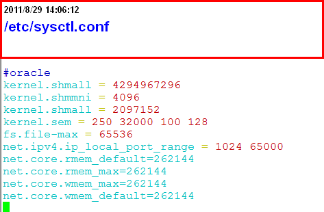

代码::

    #oracle config
    kernel.shmmni = 4096
    kernel.shmall = 2097152
    kernel.sem = 250 32000 100 128
    fs.file-max = 65536
    net.ipv4.ip_local_port_range = 1024 65000
    net.core.rmem_default=262144
    net.core.rmem_max=262144
    net.core.wmem_max=262144
    net.core.wmem_default=262144

使用 **sysctl -p** 重新加载并验证参数是否正确

设置shell调用限制
--------------------------

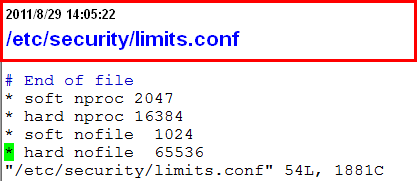

代码::

    /etc/security/limits.conf
    * soft nproc 2047
    * hard nproc 16384
    * soft nofile  1024
    * hard nofile  65536

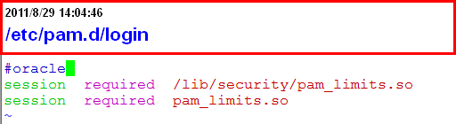

代码::

    /etc/pam.d/login
    #oracle
    session  required  /lib/security/pam_limits.so
    session  required  pam_limits.so

创建相关目录，用户组，用户
--------------------------

1. 创建组::

    Groupadd oinstall
    Groupadd dba

2. 创建用户，密码::

    Useradd –g oinstall –g dba –m oracle
    Passwd oracle

3. 创建数据库目录::

    Mkdir /opt/ora10g
    Mkdir /opt/ora10g/product
    Mkdir /opt/ora10g/oradata

4. 更改目录属主::

    Chown –R oracle:oinstall /opt/ora10g

配置oracle用户的环境变量
--------------------------
切换用户，编辑.bash_profile::

    su – oracle
    Vim .bash_profile

环境变量设置代码::

    export TMP=/tmp
    export TMPDIR=$TMP
    export ORACLE_BASE=/opt/ora10g
    export ORACLE_HOME=$ORACLE_BASE/product/10.2.0/db_1
    export ORACLE_SID=jyjs
    export ORACLE_TERM=xterm
    export PATH=/$ORACLE_HOME/bin:$PATH
    export LD_LIBRARY_PATH=$ORACLE_HOME/lib:/usr/lib:/lib64:/usr/lib64:/usr/local/lib64:/usr/X11R6/lib64/
    export CLASSPATH=$ORACLE_HOME/JRE:$ORACLE_HOME/jlib:$ORACLE_HOME/rdbms/jlib
    export LD_ASSUME_KERNEL=2.6.9
    export NLS_LANG="SIMPLIFIED CHINESE_CHINA.ZHS16GBK"
    umask  022
    if [ $USER = "oracle" ];then
        if [ $SHELL = "/bin/ksh" ];then
            ulimit -p 16384
            ulimit -n 65536
         else
        ulimit -u 16384 -n 65536
        fi
    fi
    export LANG=en_US

使改变生效

修改操作系统版本号
--------------------------

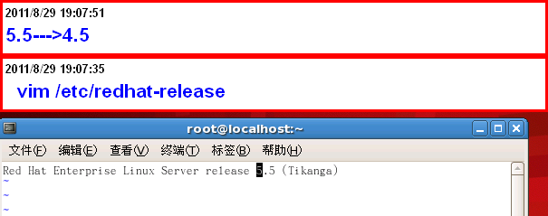

Oracle 10g会检测你的操作系统版本，在5.5下安装程序不能安装。

开始安装
--------------------------

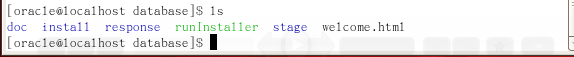

1. 执行 runlnstaller安装,如有乱码：可更改环境变量为英文

2. 安装路径

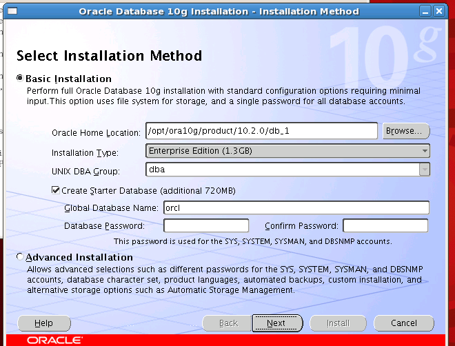

3. oracle inventory directory(oraInventory)存储系统上安装oracle软件的详细清单。 默认就可以

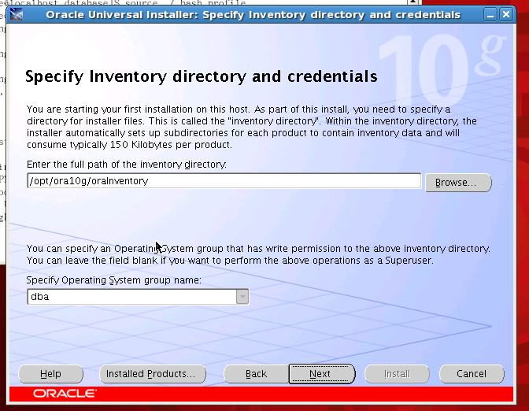

4. 安装企业版

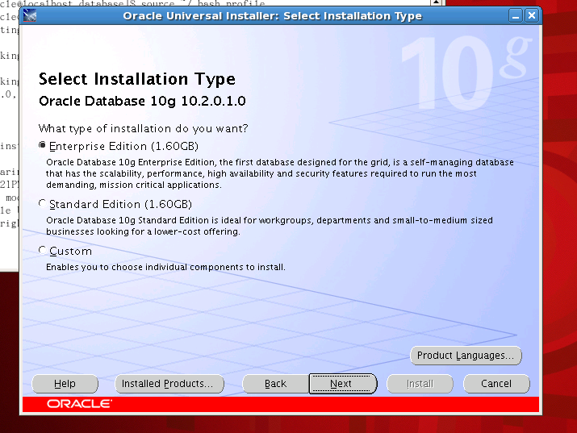

5. 检测环境是否符合oracle的要求,不行就改

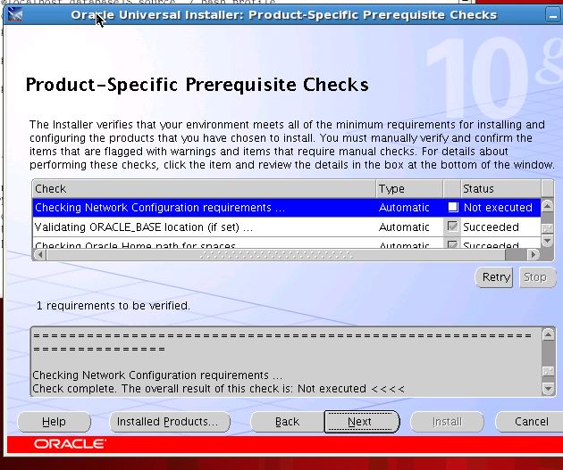

6. 创建数据库

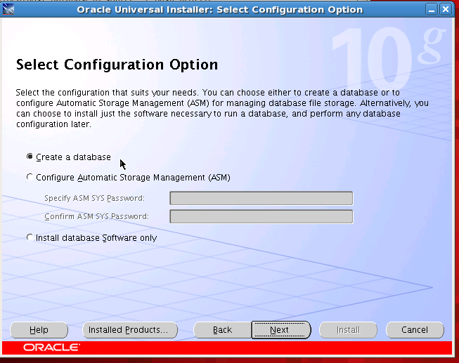

7. 数据库配置

.. image:: _image/install7.png

8. 详细的设置 字符编码设置成ZHS16GBK

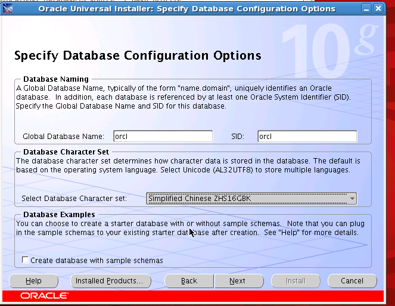

9. 邮件

.. image:: _image/install9.png

10. Oracle数据存储相关， 用操作系统的文件系统，第一个

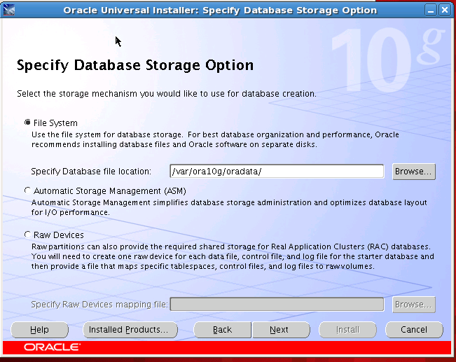

11. 备份相关，以后自己备份

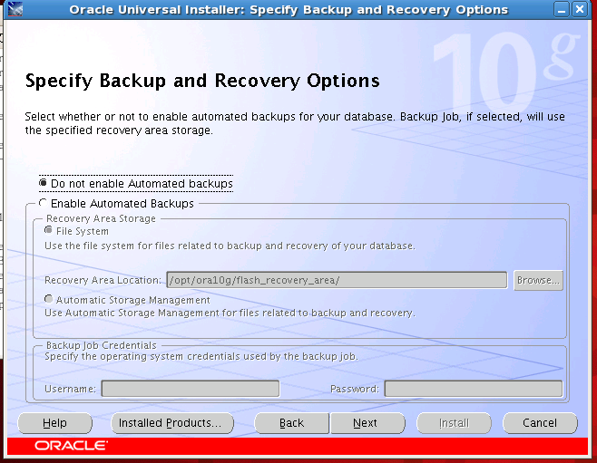

12. 密码

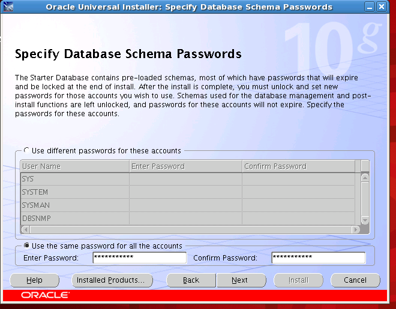

13. 安装就可以了

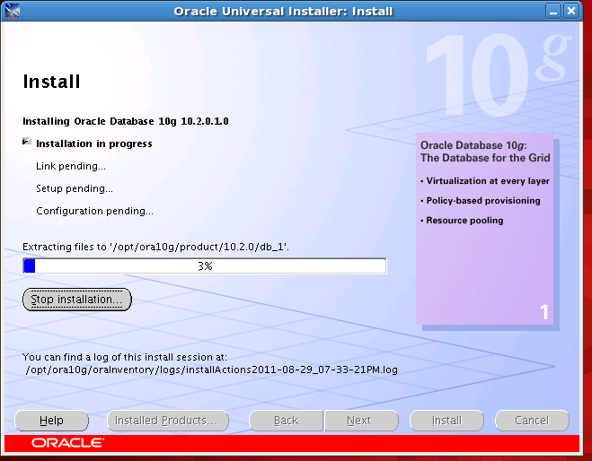

14. 安装完成

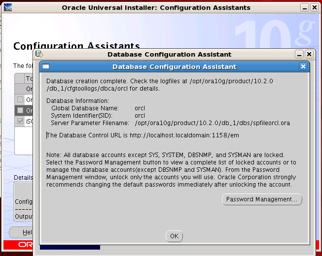

15. 有两个脚本要在root下执行

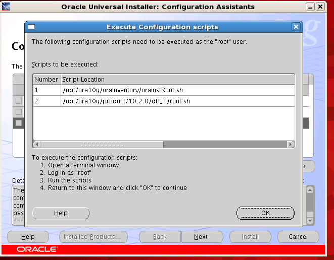

还原数据
--------------------------
1. 下载,用lftp 啊

.. image:: _image/data1.png

2. 解压

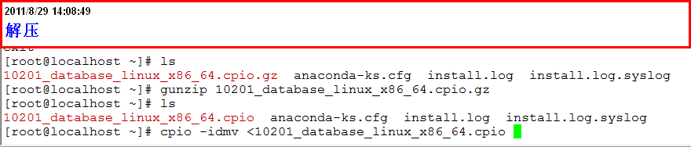

3. 在oracle帐户下登陆：

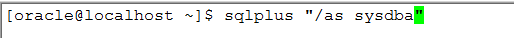

4. 创建两个数据库用户

创建用户theolenv ::

    Create user theolenv identified by password; # password 更改密码

权限::

    Grant create user,drop user,alter user,create any view,drop any view,exp_full_database,imp_full_database,dba,connect,resource,create session to theolenv;

创建用户resv2::

    Create user resv2 identified by password;

权限::

    Grant create user,drop user,alter user,create any view,drop any view,exp_full_database,imp_full_database,dba,connect,resource,create session to resv2;

5. 创建表空间::

      create TABLESPACE resv2
        LOGGING
        DATAFILE '/var/ora10g/oradata/resv_01.dbf' size 2000m REUSE AUTOEXTEND
        ON NEXT 51200k MAXSIZE 2000m,
        '/var/ora10g/oradata/resv_02.dbf' size 2000m REUSE AUTOEXTEND
        ON NEXT 51200K MAXSIZE 2000m EXTENT MANAGEMENT LOCAL SEGMENT SPACE MANAGEMENT AUTO;

      create TABLESPACE  theol
          LOGGING
          DATAFILE '/var/ora10g/oradata/theol_01.dbf' size 3000m REUSE AUTOEXTEND
          ON NEXT 51200k MAXSIZE 3900m,
          '/var/ora10g/oradata/theol_02.dbf' size 2000m REUSE AUTOEXTEND
          ON NEXT 51200K MAXSIZE 3900m,
          '/var/ora10g/oradata/theol_03.dbf' size 2000m REUSE AUTOEXTEND
          ON NEXT 51200K MAXSIZE 3900m,
          '/var/ora10g/oradata/theol_04.dbf' size 2000m REUSE AUTOEXTEND
          ON NEXT 51200K MAXSIZE 3900m
          EXTENT MANAGEMENT LOCAL SEGMENT SPACE MANAGEMENT AUTO;

6. 用户与表空间关联，将某个表空间设置成某个用户默认表空间::

      alter user resv2 default tablespace resv2;
      alter user theolenv default tablespace theol;

7. 用oracle imp工具导入数据库

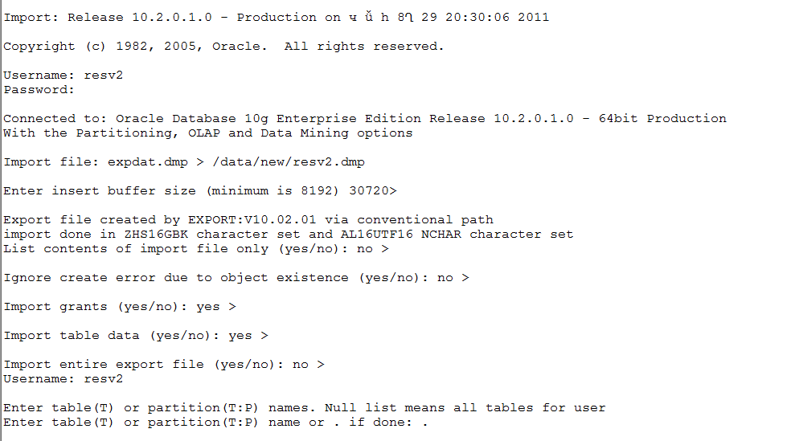

将两个数据库按同样的方法导入

8. 配置监听器,ip已经改成内网

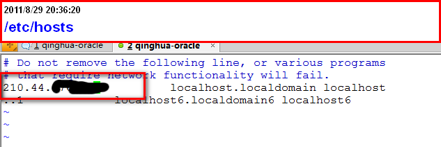

需要编辑的文件，路径信息

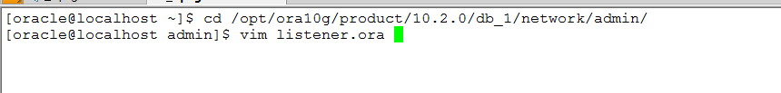

编辑文件

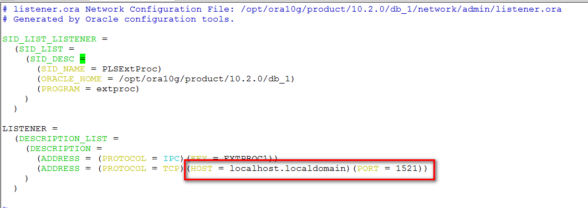

9. 启动监听器

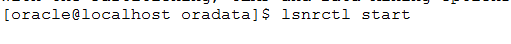

10. 启动数据库 

::

   Sqlplus “/as sysdba” # 登陆
   startup

web服务器配置
--------------------------
1. 两个配置文件，保存密码

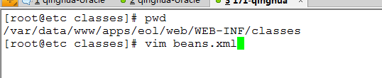

密码

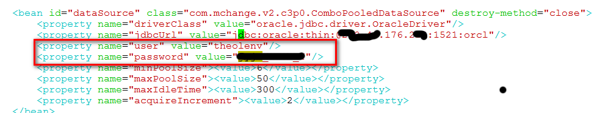

另一个配置文件

密码

.. image:: _image/web4.png

启动tomcat和apache
--------------------------

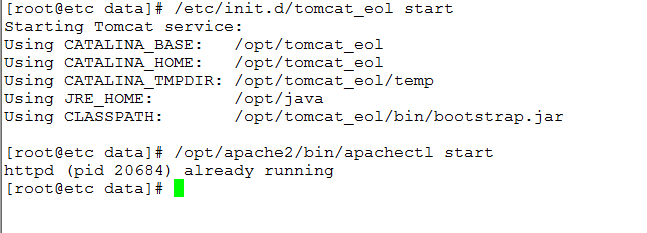

注：关闭的时候::

    先关tomcat_eol
    再关 apache

oracle数据库服务器分区信息
--------------------------
分区::

    Filesystem            Size  Used Avail Use% Mounted on
    /dev/sda2              95G  4.6G   86G   6% /
    /dev/sda7             188G  188M  178G   1% /data
    /dev/sda6             190G  188M  180G   1% /opt
    /dev/sda5             332G  259M  314G   1% /var
    /dev/sda1              99M   12M   83M  13% /boot

