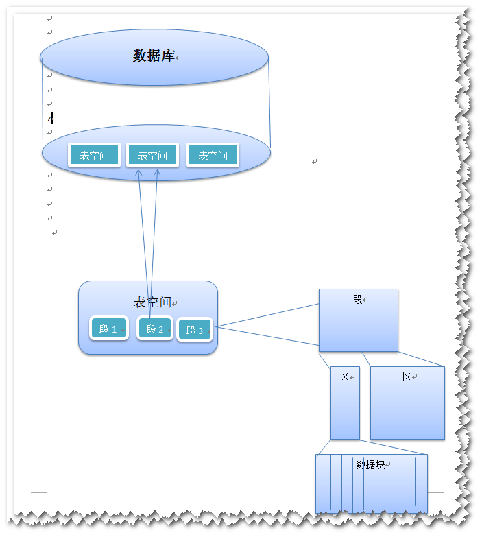
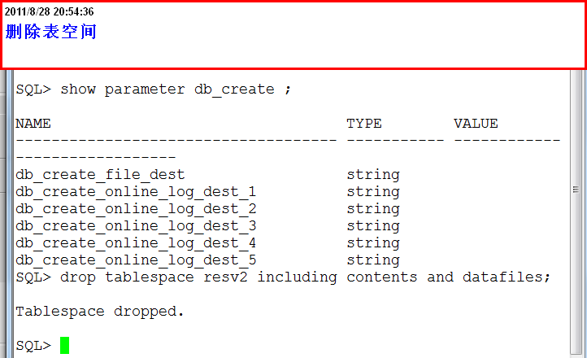

表空间的常用操作
==================

:作者: 李大双 ldshuang@gmail.com

数据库表空间的关系
--------------------------------

查看用户的默认表空间
--------------------------------

.. image:: _image/tables1.png

删除表空间
--------------------------------

