Git
===================================================================

#. `git 分支管理策略 <http://www.ruanyifeng.com/blog/2012/07/git.html>`_
#. `git - the simple guide <http://rogerdudler.github.com/git-guide/>`_
#. `Git cheat sheets <http://help.github.com/git-cheat-sheets/>`_
#. `Git 使用流程 <http://learn.github.com/p/normal.html>`_
#. `《Pro Git》中文译文 <http://progit.org/book/zh/>`_
#. `github用法指南 <http://www.worldhello.net/gotgithub/>`_
#. `git-svn <http://techbase.kde.org/Development/Tutorials/Git/git-svn>`_
#. `如何在Github上创建新项目 <http://help.github.com/create-a-repo/>`_

#. `Git资料收集 打包下载 <http://ishare.iask.sina.com.cn/f/20111841.html>`_ , 内容清单如下
    #. 最好的git中文教程.pdf
    #. 使用git版本管理手册.docx
    #. TortoiseGit使用入门.doc
    #. TortoiseGit日常使用指南.pdf
    #. ProGit 中文版.pdf
    #. git中文资料.pdf
    #. Git中文教程.pdf
    #. Git一分钟上手.pdf
    #. git手册.pdf
    #. git使用总结.doc
    #. GIT使用体会.pdf
    #. Git入门教程.doc
    #. git-tutor.pdf
    #. Git+使用教程.pdf
    #. Git_用户手册.docx

图解git
----------------------

`原文 <http://marklodato.github.com/visual-git-guide/index-zh-cn.html>`_

**正文**

基本用法
--------------
.. image:: _image/git/basic-usage.svg

上面的四条命令在工作目录、暂存目录(也叫做索引)和仓库之间复制文件。

#. git add files 把当前文件放入暂存区域。
#. git commit 给暂存区域生成快照并提交。
#. git reset -- files 用来撤销最后一次git add files，你也可以用git reset撤销所有暂存区域文件。
#. git checkout -- files 把文件从暂存区域复制到工作目录，用来丢弃本地修改。

你可以用 git reset -p, git checkout -p, or git add -p进入交互模式。

也可以跳过暂存区域直接从仓库取出文件或者直接提交代码。

git commit -a 相当于运行 git add 把所有当前目录下的文件加入暂存区域再运行。git commit.
git commit files 进行一次包含最后一次提交加上工作目录中文件快照的提交。并且文件被添加到暂存区域。
git checkout HEAD -- files 回滚到复制最后一次提交。

约定
--------------

后文中以下面的形式使用图片。

绿色的5位字符表示提交的ID，分别指向父节点。分支用橘色显示，分别指向特定的提交。
当前分支由附在其上的HEAD标识。 这张图片里显示最后5次提交，ed489是最新提交。 master分支指向此次提交，另一个maint分支指向祖父提交节点。

命令详解
--------------

Diff
^^^^^^^^^^^^^^^^^^^^^^^^^^^^^^
有许多种方法查看两次提交之间的变动。下面是一些示例。

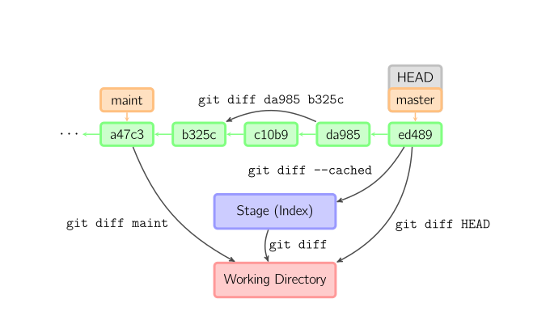

Commit
^^^^^^^^^^^^^^^^^^^^^^^^^^^^^^
提交时，git用暂存区域的文件创建一个新的提交，并把此时的节点设为父节点。然后把当前分支指向新的提交节点。下图中，当前分支是master。
在运行命令之前，master指向ed489，提交后，master指向新的节点f0cec并以ed489作为父节点。

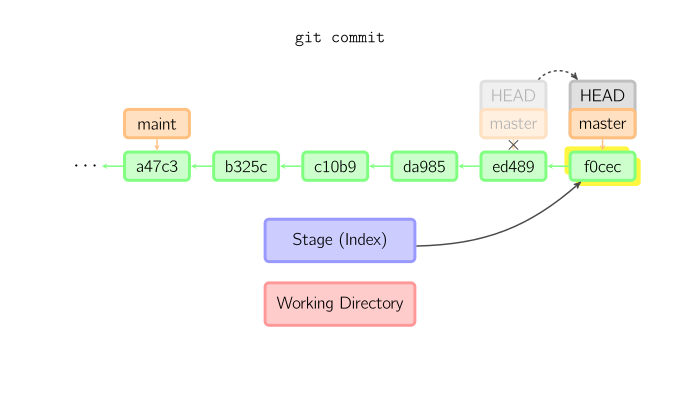

即便当前分支是某次提交的祖父节点，git会同样操作。下图中，在master分支的祖父节点maint分支进行一次提交，生成了1800b。
这样，maint分支就不再是master分支的祖父节点。此时，合并 (或者 衍合) 是必须的。

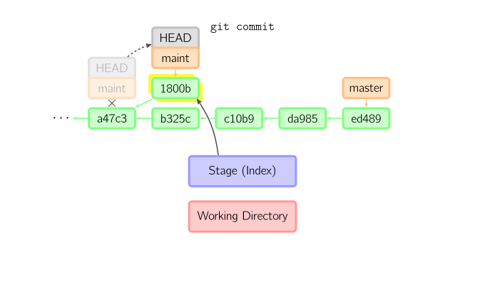

如果想更改一次提交，使用 git commit --amend。git会使用与当前提交相同的父节点进行一次新提交，旧的提交会被取消。

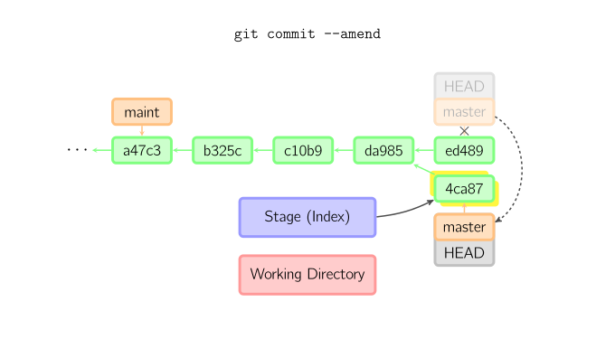

Checkout
^^^^^^^^^^^^^^^^^^^^^^^^^^^^^^
checkout命令通常用来从仓库中取出文件，或者在分支中切换。

checkout命令让git把文件复制到工作目录和暂存区域。比如git checkout HEAD~ foo.c把文件从foo.c提交节点HEAD~
(当前提交节点)复制到工作目录并且生成索引。注意当前分支没有变化。

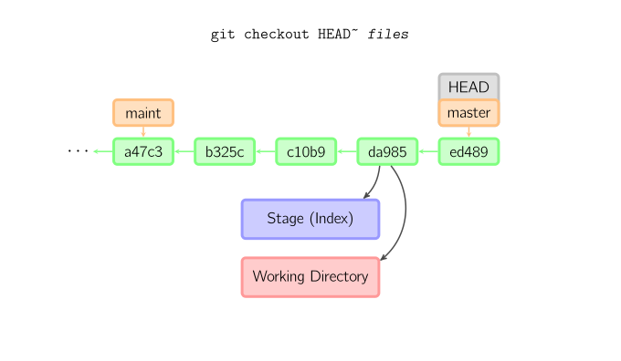

如果没有指定文件名，而是一个本地分支，那么将切换到那个分支去。同时把索引和工作目录切换到那个分支对应的状态。

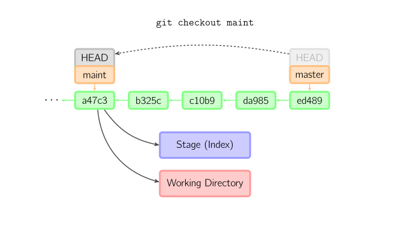

如果既没有指定文件名，也没有指定分支名，而是一个标签、远程分支、SHA-1值或者是像master~3类似的东西，
就得到一个匿名分支，称作detached HEAD。 这样可以很方便的在历史版本之间互相切换。但是，这样的提交是完全不同的，详细的在下面。

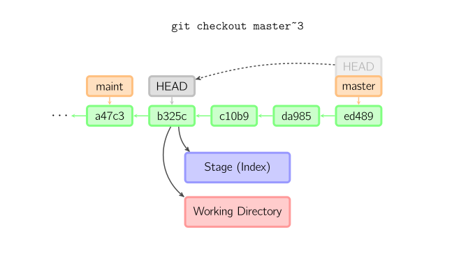

Detached HEAD(匿名分支提交)
^^^^^^^^^^^^^^^^^^^^^^^^^^^^^^
用分离HEAD提交(找不到好的译法)
HEAD是分离的时候, 提交可以正常进行, 但是没有更新已命名的分支.(可以看作是匿名分支)

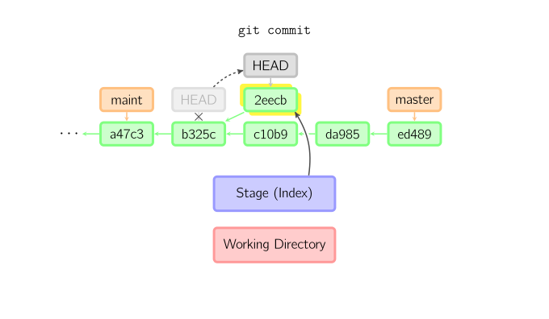

如果此时切换到别的分支，那么所作的工作会全部丢失。注意这个命令之后就不存在2eecb了。

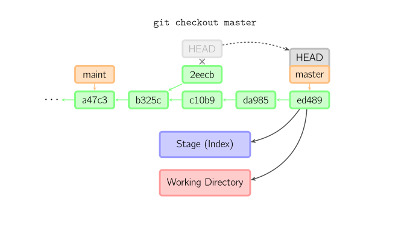

如果你想保存当前的状态，可以用这个命令创建一个新的分支: git checkout -b name。

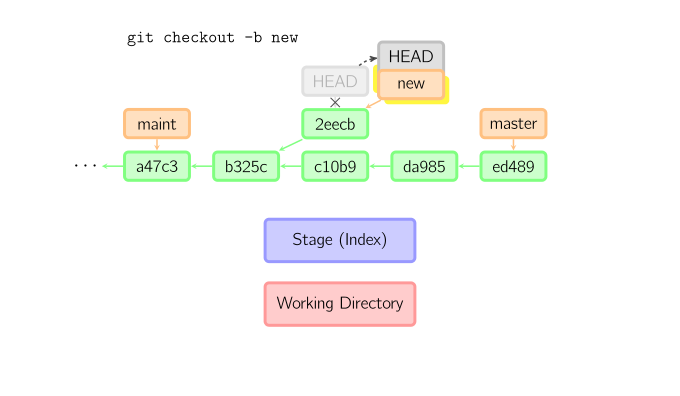

Reset
^^^^^^^^^^^^^^^^^^^^^^^^^^^^^^
reset命令把当前分支指向另一个位置，并且有选择的变动工作目录和索引。也用来在从历史仓库中复制文件到索引，而不动工作目录。

如果不给选项，那么当前分支指向到那个提交。如果用--hard选项，那么工作目录也更新，如果用--soft选项，那么都不变。

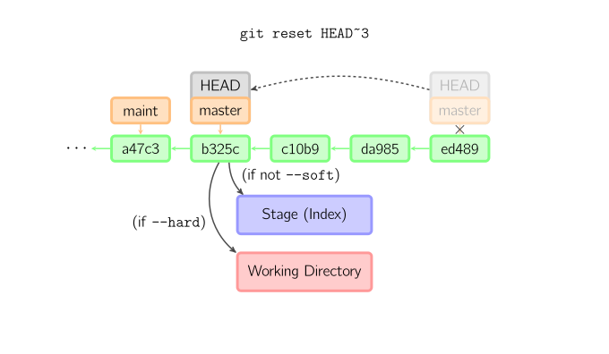

如果没有给出提交点的版本号，那么默认用HEAD。这样，分支指向不变，但是索引会回滚到最后一次提交，如果用--hard选项，工作目录也同样。

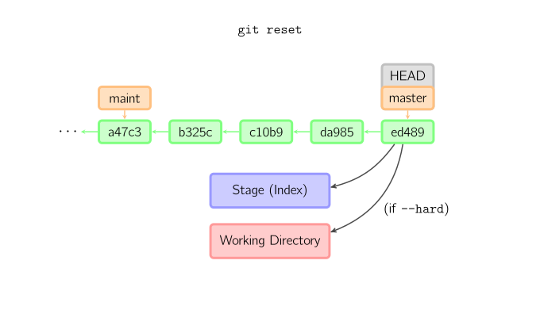

如果给了文件名(或者 -p选项), 那么工作效果和带文件名的checkout差不多，除了索引被更新。你也可以指定提交的文件，而不是HEAD

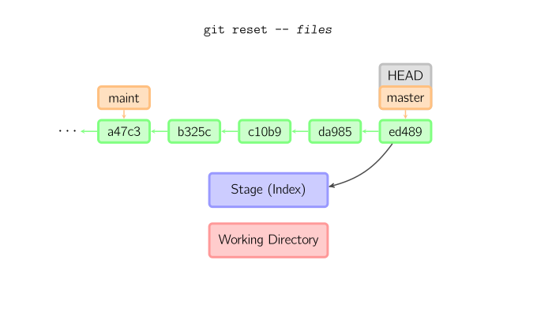

Merge
^^^^^^^^^^^^^^^^^^^^^^^^^^^^^^
merge 命令把不同分支合并起来。合并前，索引必须和当前提交相同。如果另一个分支是当前提交的祖父节点，那么合并命令将什么也不做。
另一中情况是如果当前提交是另一个分支的祖父节点，就导致fast-forward合并。指向只是简单的移动，并生成一个新的提交。

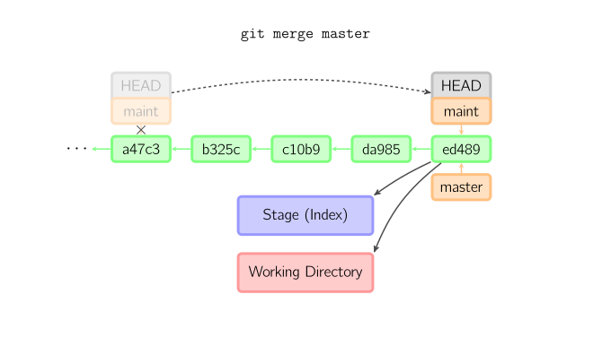

否则就是一次真正的合并。默认把当前提交(ed489 如下所示)和另一个提交(33104)以及他们的共同祖父节点(b325c)进行一次三方合并。
结果是先保存当前目录和索引，然后和父节点33104一起做一次新提交。

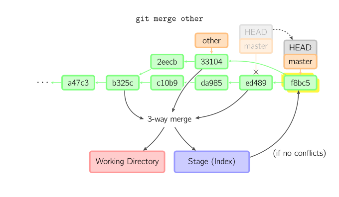

Cherry Pick
^^^^^^^^^^^^^^^^^^^^^^^^^^^^^^
cherry-pick命令"复制"一个提交节点并在当前分支做一次完全一样的新提交。

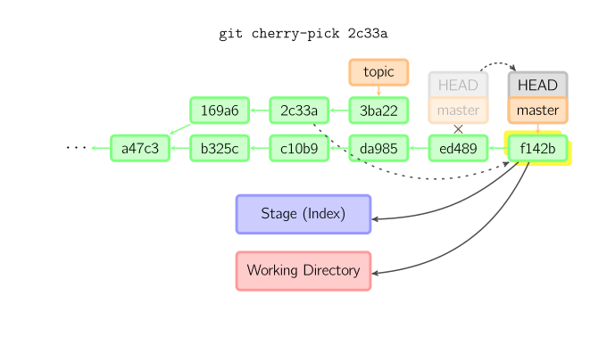

Rebase
^^^^^^^^^^^^^^^^^^^^^^^^^^^^^^
衍合是合并命令的另一种选择。合并把两个父分支合并进行一次提交，提交历史不是线性的。
衍合在当前分支上重演另一个分支的历史，提交历史是线性的。 本质上，这是线性化的自动的 cherry-pick

.. image:: _image/git/rebase.svg

上面的命令都在topic分支中进行，而不是master分支，在master分支上重演，并且把分支指向新的节点。注意旧提交没有被引用，将被回收。

要限制回滚范围，使用--onto选项。下面的命令在master分支上重演当前分支从169a6以来的最近几个提交，即2c33a。

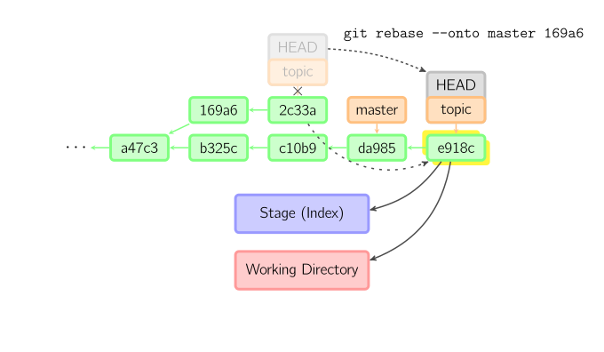

同样有git rebase --interactive让你更方便的完成一些复杂操组，比如丢弃、重排、修改、合并提交。没有图片体现着下，细节看这里 `git-rebase(1) <http://www.kernel.org/pub/software/scm/git/docs/git-rebase.html#_interactive_mode>`_

技术说明
^^^^^^^^^^^^^^^^^^^^^^^^^^^^^^
文件内容并没有真正存储在索引(.git/index)或者提交对象中，而是以blob的形式分别存储在数据库中(.git/objects)，并用SHA-1值来校验。
索引文件用识别码列出相关的blob文件以及别的数据。对于提交来说，以树(tree)的形式存储，同样用对于的哈希值识别。树对应着工作目录中的文件夹，树中包含的
树或者blob对象对应着相应的子目录和文件。每次提交都存储下它的上一级树的识别码。

如果用detached HEAD提交，那么最后一次提交会被the reflog for
HEAD引用。但是过一段时间就失效，最终被回收，与git commit --amend或者git
rebase很像。

Copyright © 2010, Mark Lodato. Chinese translation © 2012, wych.

 本著作系采用创用CC 姓名标示-非商业性-相同方式分享3.0 美国授权条款授权。

